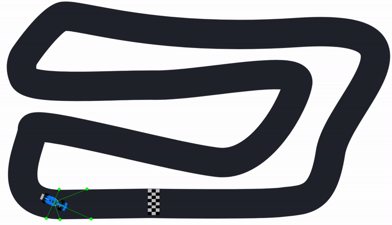

### PyGame AI Racer
This project implements a simple 2D representation of a car racing game with 3 inputs and a constant speed.
The render is redrawn for each tick according to the input feeded into it by the NEAT algorithm genomes as an ANN is constructed.

